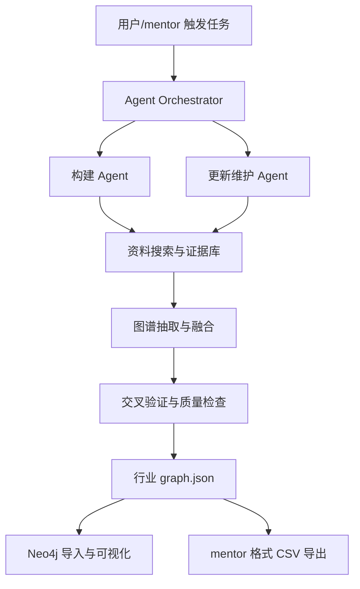
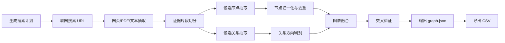
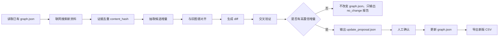

# Agent 化产业链图谱后续方案

更新日期：2026-06-22

## 1. 项目重新定位

mentor 对齐后的新定位是：

> 本项目不是单纯的产业链图谱展示应用，而是一个面向 25 个基础行业的“产业链图谱构建与维护 Agent”。

Agent 需要完成两类核心任务：

1. 构建阶段：自动联网搜索行业产业链资料，抽取节点和关系，构建符合要求的产业链图谱。
2. 更新/维护阶段：在已有图谱基础上触发增量更新，只有当有足够证据支持新增、修改或删除时才改变图谱。

每个阶段都必须包含交叉验证和质量检查环节，包括：

- 节点去重。
- 关系冲突检查。
- 层级深度检查。
- 置信度评分。
- 每个节点必须保留 URL 来源。

最终每个行业需要维护一个标准 JSON，并能导出 mentor 要求的两个 CSV：

- 节点 CSV。
- 关系 CSV。

## 2. 总体架构

建议将系统升级为四层：



### 2.1 Agent Orchestrator

负责调度任务，不建议做成完全自由发挥的聊天 Agent，而应做成 workflow-based Agent。

原因：

- 产业链图谱需要稳定、可复现、可审计。
- 更新阶段不能为了“看起来更新了”而随意改图。
- 每一步都要留下中间产物，方便 mentor 复核。

第一版可以用 Python 自研轻量 orchestrator，后续如果流程复杂再引入 LangGraph。

建议目录：

```text
industry-chain-graph/
  backend/
  frontend/
  data/
    industries/
      food_beverage/
        graph.json
        sources.jsonl
        validation_report.md
        exports/
          food_beverage_graph_node.csv
          food_beverage_graph_edge.csv
  tools/
    agent/
      build_graph.py
      update_graph.py
      export_csv.py
      validators/
      search/
      extractors/
      mergers/
```

## 3. 构建阶段 Agent 方案

### 3.1 输入

构建阶段输入包括：

- 行业 ID：如 `food_beverage`。
- 行业名称：如 `食品饮料`。
- 可选种子关键词：如 `食品饮料 产业链 上游 中游 下游`。
- 目标层级：默认 5-6 层。
- 目标关系类型：
  - `contains` / `SUBORDINATE_TO`
  - `upstream_downstream` / `DOWNSTREAM_OF`
- 资料数量上限：例如每个行业先抓取 20-50 个 URL。
- 来源优先级规则：优先公开研报、行业协会、交易所/监管披露、上市公司年报中行业描述、权威财经/产业资料。

### 3.2 输出

构建阶段输出包括：

```text
data/industries/{industry_id}/
  graph.json
  sources.jsonl
  build_report.md
  validation_report.md
  exports/
    {industry_name}_graph_node.csv
    {industry_name}_graph_edge.csv
```

### 3.3 构建流程



### 3.4 子 Agent / 工具拆分

#### Search Planner

负责生成搜索 query。

示例 query：

- `{行业名称} 产业链 上游 中游 下游`
- `{行业名称} 产业链图谱`
- `{行业名称} 行业研究报告 产业链`
- `{行业名称} 原材料 渠道 下游 应用`
- `{行业名称} 行业分类 产品结构`

输出：

```json
{
  "industry_id": "food_beverage",
  "queries": [
    "食品饮料 产业链 上游 中游 下游",
    "食品饮料 行业研究报告 产业链",
    "食品饮料 原材料 渠道 下游 应用"
  ]
}
```

#### Web Search Tool

负责联网搜索并返回候选 URL。

第一版建议做 provider abstraction，避免绑定单一搜索服务：

```text
SEARCH_PROVIDER=tavily | bing | serpapi | manual
SEARCH_API_KEY=
```

如果暂时没有搜索 API，可以先支持 `manual` 模式：人工放入 URL 列表，Agent 继续完成抽取、构建和验证。

#### Evidence Extractor

负责从 URL 中提取可用证据。

每条证据至少包含：

```json
{
  "evidence_id": "food_beverage_ev_0001",
  "url": "https://example.com/report",
  "title": "食品饮料行业产业链分析",
  "published_at": "2025-xx-xx",
  "retrieved_at": "2026-06-22",
  "content_hash": "...",
  "snippet": "食品饮料行业上游包括农产品、包装材料、食品添加剂等..."
}
```

#### Node Extractor

负责从证据中抽取候选节点。

节点候选字段：

```json
{
  "name": "包装材料",
  "node_type": "产业链环节",
  "industry": "食品饮料",
  "level": 2,
  "chain_position": "upstream",
  "description": "用于食品饮料生产、运输和销售过程中的包装环节。",
  "source_urls": ["https://example.com/report"],
  "evidence_ids": ["food_beverage_ev_0001"],
  "confidence": 0.78
}
```

注意：

- 每个节点必须至少有 1 个 URL 来源。
- 公司名称不能作为节点，但可以保留在 `公司列表` 字段中作为示例或关联公司。
- 节点命名要尽量标准化，避免同义重复。

#### Relation Extractor

负责抽取候选关系。

关系候选字段：

```json
{
  "source": "包装材料",
  "target": "食品饮料",
  "relation_type": "contains",
  "description": "包装材料属于食品饮料行业上游环节。",
  "source_urls": ["https://example.com/report"],
  "evidence_ids": ["food_beverage_ev_0001"],
  "confidence": 0.82
}
```

关系方向规则：

- `contains`：内部可以存为父节点 -> 子节点；导出为 mentor 格式时，转换为 `SUBORDINATE_TO`，方向为子节点 -> 父节点，即 “A SUBORDINATE_TO B” 表示 A 隶属于 B。
- `upstream_downstream`：内部可以存为上游节点 -> 下游节点；导出为 mentor 格式时，转换为 `DOWNSTREAM_OF`，方向为下游节点 -> 上游节点，即 “A DOWNSTREAM_OF B” 表示 A 是 B 的下游环节。

#### Graph Merger

负责融合多个来源和多次抽取结果。

规则：

- 同义节点归并，例如“乳品”和“乳制品”。
- 低置信度节点先进入待复核，不直接入正式图谱。
- 同一节点对只允许一种主关系。
- 对已有稳定节点保持 ID 不变，避免增量更新后图谱大面积漂移。

#### Graph Validator

负责交叉验证和检查。

检查项：

| 检查项 | 规则 |
| --- | --- |
| 节点来源 | 每个节点必须有至少 1 个 URL 来源 |
| 节点去重 | 名称相似、同义词、别名需要合并或标记 |
| 公司节点过滤 | 公司不能作为产业链节点，只能放在公司列表 |
| 关系冲突 | 同一节点对不能同时出现包含关系和上下游关系 |
| 层级深度 | 根节点到主要叶子节点建议覆盖 5-6 层 |
| 孤立节点 | 没有任何关系的节点进入待复核 |
| 置信度 | 低于阈值的节点/边不自动进入正式图谱 |
| 方向一致性 | 上游 -> 中游 -> 下游方向需要符合行业常识 |

### 3.5 构建阶段人机协同

Agent 不应一次性直接覆盖正式图谱，而是输出三个层级：

```text
candidate_graph.json     候选图谱
review_queue.json        待人工复核项
graph.json               通过校验后的正式图谱
```

对于低置信度、关系冲突、层级异常的内容，进入 `review_queue.json`。

## 4. 更新/维护阶段 Agent 方案

### 4.1 更新原则

更新阶段要更严格：

> 没有足够新增证据，就不改变图谱。

这点非常重要，避免 Agent 为了“更新”而制造不合适节点。

### 4.2 输入

更新阶段输入：

- 已有 `graph.json`。
- 上次构建时的 `sources.jsonl`。
- 本次新增搜索结果。
- 更新时间窗口，例如最近 30 天、90 天。
- 更新模式：
  - `check_only`：只检查是否有增量。
  - `propose`：生成更新建议。
  - `apply`：人工确认后应用更新。

### 4.3 更新流程



### 4.4 增量类型

更新建议分为四类：

```json
{
  "add_nodes": [],
  "add_edges": [],
  "modify_nodes": [],
  "remove_or_deprecate": []
}
```

第一版不建议真的删除节点，而是使用 `deprecated: true` 或进入人工复核。

### 4.5 不更新的判断

如果满足以下情况，应输出 `no_change`：

- 新资料只是重复旧资料。
- 只出现公司新闻，不能支持新增产业链节点。
- 新节点没有足够 URL 证据。
- 新关系与已有关系冲突且无法判断。
- 低置信度候选没有通过交叉验证。

输出示例：

```json
{
  "status": "no_change",
  "reason": "本次搜索资料未发现足够高置信度的产业链结构变化。",
  "checked_urls": 24,
  "new_candidate_nodes": 3,
  "accepted_nodes": 0,
  "accepted_edges": 0
}
```

## 5. 标准 graph.json 设计

为了兼容 Agent 构建、Neo4j 导入、前端展示和 mentor CSV 导出，建议扩展当前 `graph.json`。

### 5.1 节点字段

```json
{
  "id": "FOOD000001",
  "name": "食品饮料产业链",
  "node_type": "产业链",
  "tags": ["level_0"],
  "industry": "食品饮料",
  "business_description": "食品饮料产业链涵盖上游原材料、生产加工、包装、渠道和终端消费等环节。",
  "company_list": [],
  "is_key_node": true,
  "chain_segment": "root",
  "level": 0,
  "chain_position": "root",
  "source_urls": ["https://example.com/report"],
  "evidence_ids": ["food_beverage_ev_0001"],
  "confidence": 0.95,
  "updated_at": "2026-06-22"
}
```

### 5.2 关系字段

```json
{
  "id": "FOOD_EDGE_000001",
  "source": "FOOD000001",
  "target": "FOOD000002",
  "relation_type": "contains",
  "relation_weight": 1.0,
  "description": "食品饮料产业链包含上游原材料环节。",
  "source_urls": ["https://example.com/report"],
  "evidence_ids": ["food_beverage_ev_0001"],
  "confidence": 0.9,
  "updated_at": "2026-06-22"
}
```

## 6. mentor 要求的 CSV 导出格式

根据截图，mentor 需要每个行业导出两个 CSV。

### 6.1 节点 CSV

文件命名建议：

```text
{行业名称}产业链图谱_graph_node.csv
```

字段：

```text
节点id,节点类型,节点名称,节点标签,节点行业,业务描述,公司列表,关键节点,产业链环节
```

字段映射：

| CSV 字段 | graph.json 字段 | 说明 |
| --- | --- | --- |
| 节点id | `node.id` | 行业稳定 ID |
| 节点类型 | `node.node_type` | 如 产业链、产业链环节、产品、原材料 |
| 节点名称 | `node.name` | 标准节点名称 |
| 节点标签 | `node.tags` | 如 `level_0`、`level_1` |
| 节点行业 | `node.industry` | 如 食品饮料 |
| 业务描述 | `node.business_description` | 简短描述 |
| 公司列表 | `node.company_list` | 第一版可为空 |
| 关键节点 | `node.is_key_node` | 可输出 true/false 或 1/0 |
| 产业链环节 | `node.chain_segment` | 上游/中游/下游/支持/root |

补充要求：

- URL 来源不在截图字段里，但 graph.json 内必须保留。
- 如 mentor 后续要求 CSV 也带来源，可以新增 `url来源` 字段或单独导出 evidence CSV。

### 6.2 关系 CSV

文件命名建议：

```text
{行业名称}产业链图谱_upstream_downstream_graph_edge.csv
```

或按实际关系拆成：

```text
{行业名称}产业链图谱_sub_graph_edge_filtered.csv
{行业名称}产业链图谱_upstream_downstream_graph_edge.csv
```

字段：

```text
起点节点id,起点节点名称,终点节点id,终点节点名称,关系类型,关系权重,关系描述
```

字段映射：

| CSV 字段 | graph.json 字段 | 说明 |
| --- | --- | --- |
| 起点节点id | `edge.source` | 关系起点 |
| 起点节点名称 | source node name | 由节点表反查 |
| 终点节点id | `edge.target` | 关系终点 |
| 终点节点名称 | target node name | 由节点表反查 |
| 关系类型 | mapped relation type | `SUBORDINATE_TO` 或 `DOWNSTREAM_OF` |
| 关系权重 | `edge.relation_weight` | 默认 1.0 |
| 关系描述 | `edge.description` | 简短关系说明 |

关系类型映射建议：

| 内部关系 | mentor CSV 关系 | 说明 |
| --- | --- | --- |
| `contains` | `SUBORDINATE_TO` | 导出方向为子节点 -> 父节点，表示 A 隶属于 B |
| `upstream_downstream` | `DOWNSTREAM_OF` | 导出方向为下游节点 -> 上游节点，表示 A 是 B 的下游环节 |

工程约定：

- `A SUBORDINATE_TO B`：A 隶属于 B。
- `A DOWNSTREAM_OF B`：A 是 B 的下游环节。
- 内部图谱为了可视化和查询方便，可以保留 `contains` 的父 -> 子、`upstream_downstream` 的上游 -> 下游方向；导出 CSV 时统一转换成 mentor 要求的方向和关系名。

## 7. API 与前端改造建议

### 7.1 后端新增 API

```text
POST /api/agent/build
POST /api/agent/update
GET  /api/agent/runs/{run_id}
GET  /api/agent/runs/{run_id}/report
POST /api/industries/{industry_id}/export-csv
GET  /api/industries/{industry_id}/exports
```

### 7.2 前端新增页面

建议新增一个 Agent 工作台：

- 行业选择。
- 构建图谱按钮。
- 更新检查按钮。
- Agent 运行进度。
- 搜索到的 URL 列表。
- 候选节点/边数量。
- 校验报告。
- 待复核队列。
- 导出 CSV 按钮。

当前已有图谱可视化、筛选、问答模块可以保留，作为 Agent 输出结果的展示和验收界面。

## 8. 分阶段实施计划

### 阶段 1：格式与校验先行

目标：先把工程底座打稳。

任务：

- 扩展 `graph.json` schema，增加 `source_urls`、`confidence`、`company_list`、`is_key_node`、`chain_segment` 等字段。
- 实现 `validate_graph.py`。
- 实现 `export_csv.py`，把每个行业 JSON 转成 mentor 要求的节点 CSV 和关系 CSV。
- 对当前食品饮料图谱补 URL 来源字段，哪怕第一版先人工补。

交付：

- 食品饮料新版 `graph.json`。
- 食品饮料节点 CSV。
- 食品饮料关系 CSV。
- 食品饮料校验报告。

### 阶段 2：构建 Agent MVP

目标：Agent 能从 URL 资料构建候选图谱。

任务：

- 支持 manual URL 输入。
- 抽取网页/PDF 文本。
- LLM 抽取候选节点和关系。
- 输出 `candidate_graph.json`。
- 运行校验并生成 `review_queue.json`。

交付：

- 食品饮料 v0.2 候选图谱。
- 构建报告。
- 待复核列表。

### 阶段 3：联网搜索 Agent

目标：Agent 能自动搜索资料。

任务：

- 接入搜索 API。
- 自动生成 query。
- 对搜索结果去重、排序、过滤。
- 建立 `sources.jsonl` 证据库。

交付：

- 自动搜索 + 构建食品饮料图谱。
- 新增 1-2 个行业试点。

### 阶段 4：更新维护 Agent

目标：Agent 能严谨地做增量更新。

任务：

- 实现 `update_graph.py`。
- 对比新旧证据和图谱。
- 输出 `update_proposal.json`。
- 无高置信增量时输出 `no_change`，不修改正式图谱。

交付：

- 食品饮料增量检查报告。
- 一个行业的更新提案 demo。

### 阶段 5：批量行业生产

目标：扩展到 25 个行业。

任务：

- 固定行业清单。
- 固定搜索 query 模板。
- 固定 schema、校验规则和 CSV 导出格式。
- 每个行业输出 graph.json、sources.jsonl、validation_report.md、节点 CSV、关系 CSV。

交付：

- 25 个行业产业链图谱数据包。

## 9. 当前优先级建议

下一步不要马上改前端，建议先做三个底层能力：

1. `export_csv.py`：先满足 mentor 最终格式要求。
2. `validate_graph.py`：先建立图谱质量检查标准。
3. `build_graph.py` 的 manual URL MVP：先让 Agent 从指定 URL 生成候选图谱。

原因：

- CSV 是 mentor 最终要用的交付形态。
- 校验是 Agent 可信的前提。
- 联网搜索可以稍后接，先用人工 URL 验证构建链路更稳。

## 10. 向 mentor 需要确认的问题

建议继续确认：

1. 节点 CSV 是否必须包含 URL 来源字段？如果截图格式不能改，是否需要单独 evidence CSV？
2. 公司列表字段是否需要填充代表公司，还是第一版允许为空？
3. 关键节点字段的判断口径是什么：人工指定、中心性评分，还是上游/中游/下游关键环节？
4. 每个行业标准图谱大概希望多少节点、多少边？
5. 搜索来源是否有黑白名单，例如是否允许使用东方财富、Alpha 派可见页面、公众号文章、券商研报摘要等？

